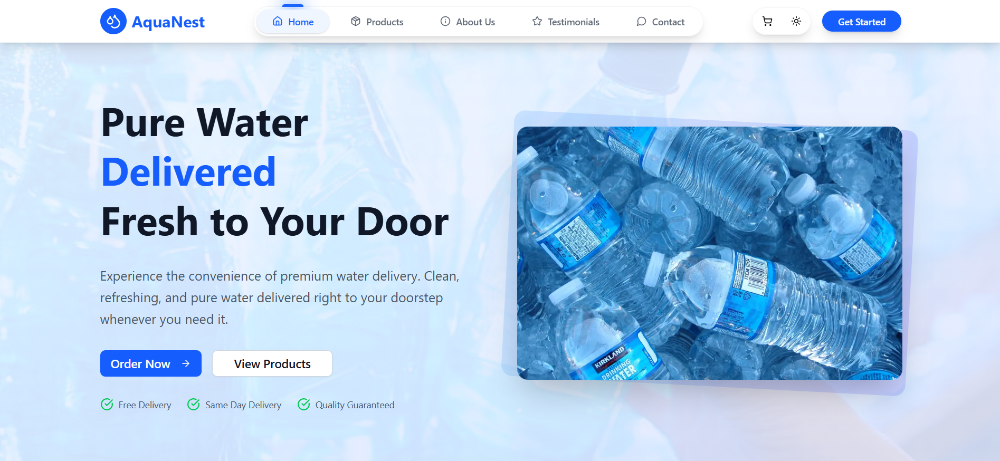
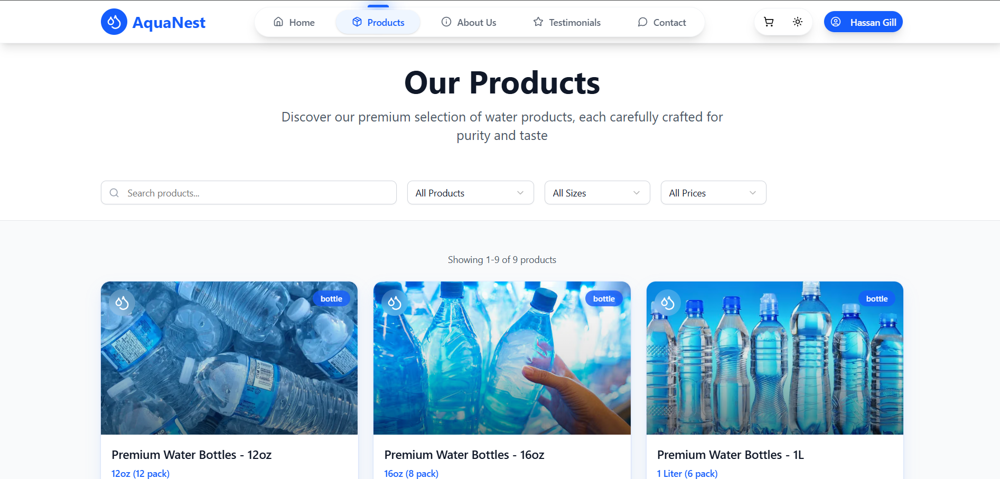
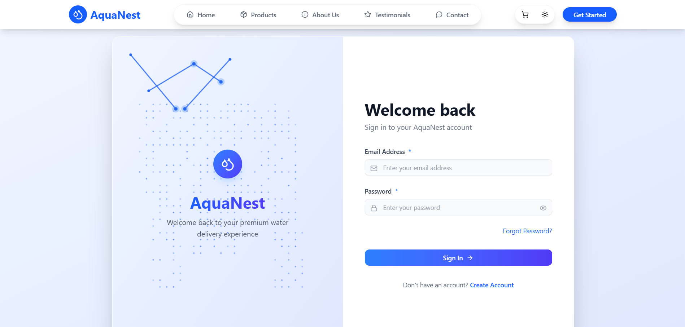
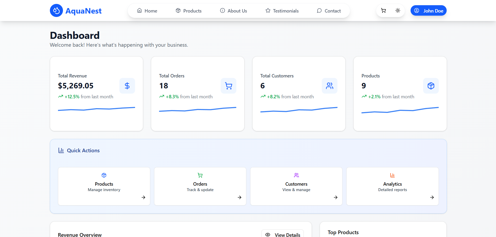
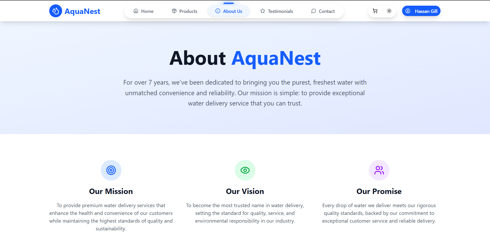
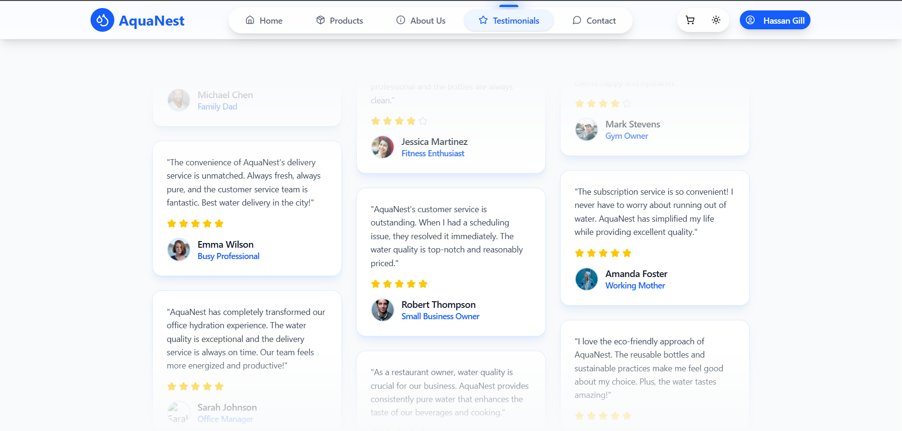
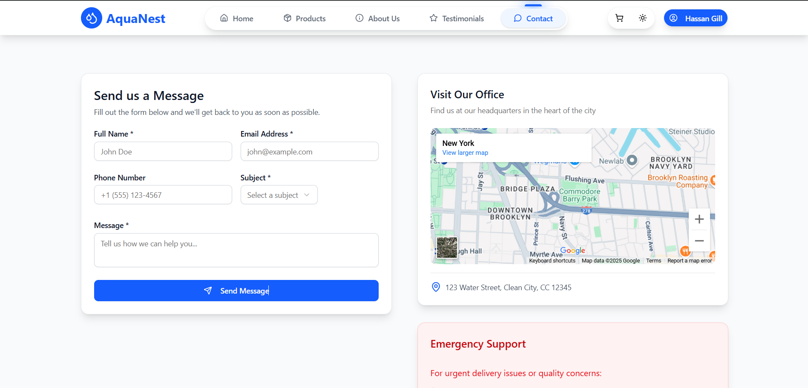

# 🌊 AquaNest - Premium Water Delivery Service

<div align="center">
  
  **A modern, full-stack water delivery platform built with Next.js and Express.js**
  
  [](https://nextjs.org/)
  [](https://www.typescriptlang.org/)
  [](https://www.mongodb.com/)
  [](https://vercel.com/)
  [](https://railway.app/)
</div>

## 🌟 Overview

AquaNest is a premium water delivery service that brings fresh, pure water directly to your doorstep. Our platform features a modern, responsive design with smooth animations, real-time order tracking, and a comprehensive admin dashboard for business management.

### 🎯 Key Highlights
- **🚀 Modern Stack:** Built with Next.js 14, Express.js, and MongoDB
- **🎨 Beautiful UI:** Tailwind CSS with Framer Motion animations
- **📱 Responsive:** Mobile-first design that works on all devices
- **🔒 Secure:** JWT authentication with bcrypt password hashing
- **⚡ Fast:** Optimized for performance with static generation
- **☁️ Cloud-Ready:** Deployed on Vercel (frontend) and Railway (backend)

## 📸 Application Preview

### 🏠 Homepage

*Experience our modern, responsive design with smooth animations and intuitive navigation*

### 🛒 Products Catalog

*Browse our extensive collection of water bottles, gallons, and dispensers with smart filtering*

### 🔐 User Authentication

*Secure user authentication with beautiful, responsive login/register forms*

### 📊 Admin Dashboard

*Comprehensive admin panel with real-time analytics, order management, and business insights*

### ℹ️ About Us

*Learn about our mission, vision, and commitment to delivering pure water*

### ⭐ Customer Testimonials

*Real customer reviews and testimonials showcasing our excellent service*

### 📞 Contact Us

*Easy-to-use contact form and business information for customer support*

## ✨ Features

### 👤 Customer Experience
- **🏠 Landing Page** - Stunning hero section with animated water bottle
- **🧪 Product Catalog** - Browse bottles, gallons, and dispensers with smart filtering
- **🛒 Shopping Cart** - Smooth animations and real-time cart updates
- **🔐 Authentication** - Secure user registration and login
- **📦 Order Management** - Place orders and track delivery status
- **📱 Responsive Design** - Seamless experience across all devices

### �‍💼 Admin Dashboard
- **📊 Analytics** - Real-time sales charts and business insights
- **🏷️ Product Management** - Add, edit, and manage product catalog
- **📋 Order Management** - View and update order status
- **👥 Customer Management** - View customer information and order history
- **⚙️ Settings** - Configure business settings and preferences

## 🛠️ Technology Stack

<table>
<tr>
<td>

**Frontend**
- ⚛️ Next.js 14 (App Router)
- 🎨 Tailwind CSS
- ✨ Framer Motion
- 🗃️ Zustand (State Management)
- 📝 React Hook Form + Zod
- 🌐 Axios (HTTP Client)

</td>
<td>

**Backend**
- 🟢 Node.js + Express.js
- 🍃 MongoDB + Mongoose
- 🔐 JWT + bcryptjs
- ✅ Joi (Validation)
- 📁 Multer (File Upload)
- ☁️ Cloudinary (Image Storage)

</td>
</tr>
</table>

## 🏗️ Project Architecture

```
aquanest/
├── 🎨 frontend/                 # Next.js Application
│   ├── src/
│   │   ├── app/                # App Router Pages
│   │   │   ├── (auth)/         # Authentication Routes
│   │   │   ├── admin/          # Admin Dashboard
│   │   │   ├── products/       # Product Pages
│   │   │   └── ...             # Other Pages
│   │   ├── components/         # Reusable Components
│   │   │   ├── ui/             # UI Components
│   │   │   ├── layout/         # Layout Components
│   │   │   └── sections/       # Page Sections
│   │   ├── lib/                # Utilities & Config
│   │   ├── store/              # Zustand Stores
│   │   └── types/              # TypeScript Types
│   └── public/                 # Static Assets
├── 🔧 backend/                  # Express.js API
│   ├── controllers/            # Route Handlers
│   ├── models/                 # Database Models
│   ├── routes/                 # API Routes
│   ├── middleware/             # Custom Middleware
│   └── scripts/                # Database Scripts
└── 📚 docs/                    # Documentation
```

## 🚀 Quick Start

### Prerequisites
- Node.js 18+ and npm
- MongoDB Atlas account
- Git

### 1️⃣ Clone Repository
```bash
git clone https://github.com/HassanRehman9393/aquanest.git
cd aquanest
```

### 2️⃣ Backend Setup
```bash
cd backend
npm install

# Create .env file
cp .env.example .env
# Edit .env with your MongoDB connection string and JWT secret
```

### 3️⃣ Frontend Setup
```bash
cd ../frontend
npm install

# Create .env.local file
cp .env.example .env.local
# Edit .env.local with your backend API URL
```

### 4️⃣ Database Setup
```bash
# Seed database with sample data
cd backend
npm run seed:products
npm run seed:orders
```

### 5️⃣ Run Development Servers
```bash
# Terminal 1 - Backend
cd backend
npm run dev

# Terminal 2 - Frontend
cd frontend
npm run dev
```

Visit `http://localhost:3000` to see the application!

## 🔧 Environment Variables

### Backend (.env)
```env
PORT=5000
MONGODB_URI=your_mongodb_connection_string
JWT_SECRET=your_super_secret_jwt_key
JWT_EXPIRE=7d
NODE_ENV=development
FRONTEND_URL=http://localhost:3000
CLOUDINARY_CLOUD_NAME=your_cloudinary_name
CLOUDINARY_API_KEY=your_cloudinary_key
CLOUDINARY_API_SECRET=your_cloudinary_secret
```

### Frontend (.env.local)
```env
NEXT_PUBLIC_API_URL=http://localhost:5000/api
NEXT_PUBLIC_APP_NAME=AquaNest
NEXT_PUBLIC_APP_DESCRIPTION=Premium Water Delivery Service
```

## 🌐 Live Demo

<div align="center">
  
**🌍 [Live Application](https://aquanest-ochre.vercel.app/)** | **📚 [API Documentation](./API.md)**

*Demo Credentials:*
- **Customer:** demo@aquanest.com / password123
- **Admin:** johndoe@gmail.com / John123

</div>

## 🔑 Admin Dashboard Access

To access the **Admin Dashboard** with full management capabilities:

1. **Visit:** [https://aquanest-ochre.vercel.app/](https://aquanest-ochre.vercel.app/)
2. **Login with Admin Credentials:**
   - **Email:** `johndoe@gmail.com`
   - **Password:** `John123`
3. **Navigate to:** Admin panel will be accessible after login

**Admin Features:**
- 📊 Real-time sales analytics and business insights
- 🏷️ Complete product catalog management (Add/Edit/Delete)
- 📋 Order management with status tracking
- 👥 Customer information and order history
- ⚙️ Business settings and configuration

## 📱 Application Features

### 🏠 Homepage
- **Hero Section** with animated water bottle and smooth transitions
- **Company Overview** with mission, vision, and values
- **Featured Products** carousel with interactive cards
- **Customer Testimonials** with star ratings and reviews

### 🛒 Product Catalog
- **Smart Filtering** by category (bottles, gallons, dispensers)
- **Search Functionality** with real-time results
- **Product Details** with high-quality images and descriptions
- **Add to Cart** with smooth animations and quantity controls

### 📊 Admin Dashboard
- **Sales Analytics** with interactive charts and graphs
- **Order Management** with status tracking and updates
- **Product Management** with CRUD operations
- **Customer Management** with detailed user profiles

## 🎨 Key Features Showcase

### ✨ Smooth Animations
- Framer Motion powered page transitions
- Interactive cart animations
- Smooth scrolling and hover effects
- Loading states and micro-interactions

### 📱 Responsive Design
- Mobile-first approach
- Optimized for tablets and desktop
- Touch-friendly interfaces
- Cross-browser compatibility

### 🔒 Security Features
- JWT token authentication
- Password hashing with bcrypt
- Input validation and sanitization
- CORS protection
- Rate limiting

## 🛠️ Development

### Available Scripts

**Backend:**
```bash
npm run dev          # Start development server
npm start           # Start production server
npm run seed:products # Seed products data
npm run seed:orders  # Seed orders data
```

**Frontend:**
```bash
npm run dev         # Start development server
npm run build       # Build for production
npm run start       # Start production server
npm run lint        # Run ESLint
```

### 🧪 Testing
```bash
# Run backend tests
cd backend
npm test

# Run frontend tests
cd frontend
npm test
```

## 🚀 Deployment

### Backend (Railway)
1. Create Railway project
2. Connect GitHub repository
3. Set root directory to `backend`
4. Configure environment variables
5. Deploy!

### Frontend (Vercel)
1. Create Vercel project
2. Connect GitHub repository
3. Set root directory to `frontend`
4. Configure environment variables
5. Deploy!

## 📈 Performance

- ⚡ **Core Web Vitals:** Optimized for excellent scores
- 🎯 **Lighthouse Score:** 90+ across all metrics
- 📦 **Bundle Size:** Optimized with code splitting
- 🚀 **Load Time:** < 2s first contentful paint

## 🤝 Contributing

We welcome contributions! Please see our [Contributing Guide](CONTRIBUTING.md) for details.

1. Fork the repository
2. Create your feature branch (`git checkout -b feature/AmazingFeature`)
3. Commit your changes (`git commit -m 'Add some AmazingFeature'`)
4. Push to the branch (`git push origin feature/AmazingFeature`)
5. Open a Pull Request

## 📄 License

This project is licensed under the MIT License - see the [LICENSE](LICENSE) file for details.

## 🙏 Acknowledgments

- **Design Inspiration:** Modern e-commerce platforms
- **Icons:** Lucide React
- **Images:** Unsplash
- **Animations:** Framer Motion
- **UI Components:** Radix UI

## 📞 Support

- 📧 **Email:** hassangill9393@gmail.com
- 🐛 **Issues:** [GitHub Issues](https://github.com/HassanRehman9393/aquanest/issues)
- 💬 **Discussions:** [GitHub Discussions](https://github.com/HassanRehman9393/aquanest/discussions)

---

<div align="center">
  <p><strong>Made with ❤️ by Hassan Rehman</strong></p>
  <p>⭐ Star this repo if you find it helpful!</p>
</div>


